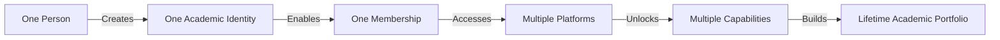
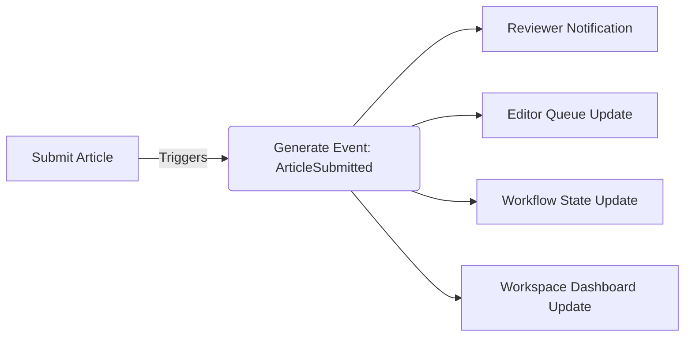
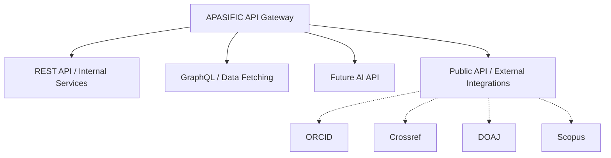
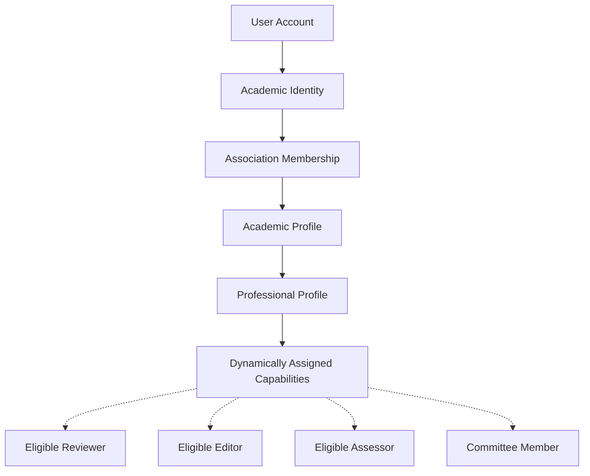
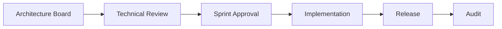

# APASIFIC ONE: Volume 2 - Enterprise Architecture Blueprint

**Project Codename:** APASIFIC ONE  
**Platform:** Integrated Academic Ecosystem Platform (IAEP)  
**Document Type:** Enterprise Architecture Master Blueprint (Frozen)  
**Phase:** Sprint 0 (Architecture Freeze)

> [!IMPORTANT]
> **APASIFIC ONE** is an **Integrated Academic Ecosystem Platform (IAEP)** designed for 10-20 years of evolutionary lifespan. This document (Volume 2 of the Master Documentation) serves as the immutable technical foundation for all subsequent sprints.

---

## 1. Enterprise Platform Map

The overarching ecosystem map defining the relationship between Experience, Management, Core Services, Data, and Infrastructure.

```text
                         APASIFIC ONE (IAEP)
                               │
      ┌────────────────────────────────────────────┐
      │                                            │
Experience Layer                             Management Layer
      │                                            │
      ▼                                            ▼
Public Experience Portal                 Enterprise Management
Membership Portal
Publication Portal
Certification Portal
Conference Portal
Research Portal
Community Portal
Awards Portal
      │
      ▼
──────────── Core Shared Services ────────────
Identity
Workflow
Notification
Payment
Document
Search
Media
Analytics
AI
──────────── Data Platform ────────────
Master Data
Transactional Data
Data Warehouse
Knowledge Graph
──────────── Infrastructure ────────────
Cloud
Container
Security
CDN
Storage
Backup
```

---

## 2. The Technical DNA: Academic Digital Identity

The absolute DNA of APASIFIC ONE rests on this foundational flow:



---

## 3. Enterprise Layer Architecture

The platform architecture is strictly tiered to ensure isolation and scalability.

```mermaid
graph TD
    subgraph 1. Experience Layer
        Web[Web Apps]
        Mob[Mobile Ready]
        Dash[Dynamic Workspaces]
    end
    subgraph 2. Business Platform Layer
        Mem[Membership]
        Pub[Publication]
        Cert[Certification]
        Conf[Conference]
    end
    subgraph 3. Shared Platform Services
        Auth[Authentication]
        Iden[Academic Identity]
        Work[Workflow Engine]
        Notif[Notification]
    end
    subgraph 4. Data Layer
        Master[(Master Data)]
        Trans[(Transactional Data)]
    end
    subgraph 5. Infrastructure Layer
        Cloud[Cloud Native]
        CDN[Edge Network]
        Sec[Security/WAF]
    end

    1. Experience Layer --> 2. Business Platform Layer
    2. Business Platform Layer --> 3. Shared Platform Services
    3. Shared Platform Services --> 4. Data Layer
    4. Data Layer --> 5. Infrastructure Layer
```

---

## 4. Capability Map

A top-level mapping of business capabilities across the primary platforms.

- **Membership Platform**
  - Registration & Onboarding
  - Identity Verification
  - Subscription & Renewal
  - Community Engagement
- **Publication Platform**
  - Manuscript Submission
  - Double-Blind Peer Review
  - DOI Minting & Indexing
  - Publishing & Archives
- **Certification Platform**
  - Competency Standards
  - Online Examination (CBT)
  - Interview Scheduling & Assessment
  - Professional Registry & Digital Certificates
- **Conference Platform**
  - Call for Papers (CFP)
  - Ticketing & Registration
  - Speaker & Schedule Management
- **Enterprise Management Platform**
  - System Administration
  - Organization Administration
  - Workflow & Content Management
  - Global Analytics & Security
  - System Configuration & Monitoring

---

## 5. Data Architecture

Strict separation of data concerns to preserve database integrity at scale.

**A. Master Data (Slow moving, highly referenced)**
- Academic Identity (Users)
- Institutions & Universities
- Countries & Regions
- Academic Disciplines (14 Divisions)
- Certification Standards
- Journal Metadata

**B. Transactional Data (Fast moving, high volume)**
- Submissions & Review Histories
- Exam Attempts & Interview Scores
- Payments & Invoices
- Registration Logs
- System Audit Trails

---

## 6. Event-Driven Architecture

Inter-platform interactions utilize asynchronous events to prevent tight coupling.



---

## 7. API Architecture

The ecosystem embraces an **API-First** approach to facilitate both internal communication and external interoperability.



---

## 8. Identity Architecture (Identity-Driven, Not Role-Based)

Capabilities emerge dynamically from **Academic Identity**, not static manual role assignment.



---

## 9. Domain Driven Design (Bounded Contexts)

Each platform operates within a strict Bounded Context.
- The **Publication Context** does not interfere with the **Certification Context**.
- They both rely on the **Identity Context** (Shared Service) to know *who* is performing the action, but manage their own specific business logic completely independently.

---

## 10. Technology Principles

The DNA of APASIFIC ONE's technical implementation:

- **Cloud Native**: Designed for containerization and auto-scaling.
- **API First**: Backend logic is decoupled from frontend presentation.
- **Database First**: Strong relational integrity for Master Data.
- **Microservice Ready**: Built as a modular monolith, ready to split into microservices if needed.
- **AI Ready**: Data structured to allow future machine learning overlays (Recommendation Engine, Similarity Detection, Knowledge Graph).
- **Mobile Ready**: Responsive-first experience layer.
- **Accessibility Ready**: Adherence to global web accessibility standards.
- **SEO Ready**: Optimized for indexing academic content globally.

---

## 11. Non-Functional Requirements (NFR)

Enterprise-grade expectations for the platform:

- **Availability**: 99.9% Uptime target.
- **Security**: OWASP Top 10 compliance, Data encryption at rest and in transit.
- **Performance**: < 2 seconds page load time, sub-second API response.
- **Scalability**: Designed to handle 1,000,000+ active users globally.
- **Multi-Country**: Yes (Timezone, currency, and locale aware).
- **Multi-Language**: Yes (Architecture supports i18n out of the box).

---

## 12. Platform Governance & Lifecycle

Strict processes governing the evolution of the platform.

**A. Platform Lifecycle**
`Idea ➔ Planning ➔ Implementation ➔ Testing ➔ Deployment ➔ Operation ➔ Monitoring ➔ Continuous Improvement`

**B. Platform Governance**


---

## 13. Master Development Roadmap

- **Sprint 0 – Enterprise Architecture Blueprint** *(Current: Frozen)*
- **Sprint 1 – Public Experience Portal** *(Corporate UI/UX, Component Library)*
- **Sprint 2 – Membership Platform** *(Identity Engine, Academic Profiles, SSO)*
- **Sprint 3 – Certification Platform** *(BOC Governance, Standards, ASIACERT, Registry)*
- **Sprint 4 – Scholarly Publication Platform** *(Journals, Books, OJS-style Workflow)*
- **Sprint 5 – Conference & Research Platform** *(CFP, Grants, Academic Mobility)*
- **Sprint 6 – Enterprise Management Platform** *(SuperAdmin, Analytics, Workflow Configuration)*

> [!CAUTION]
> **ARCHITECTURE FREEZE**
> Upon approval of this document, Sprint 0 is officially completed. All subsequent development sprints (Sprint 1-6) must strictly adhere to the constraints, layers, and domains established in this Blueprint.
