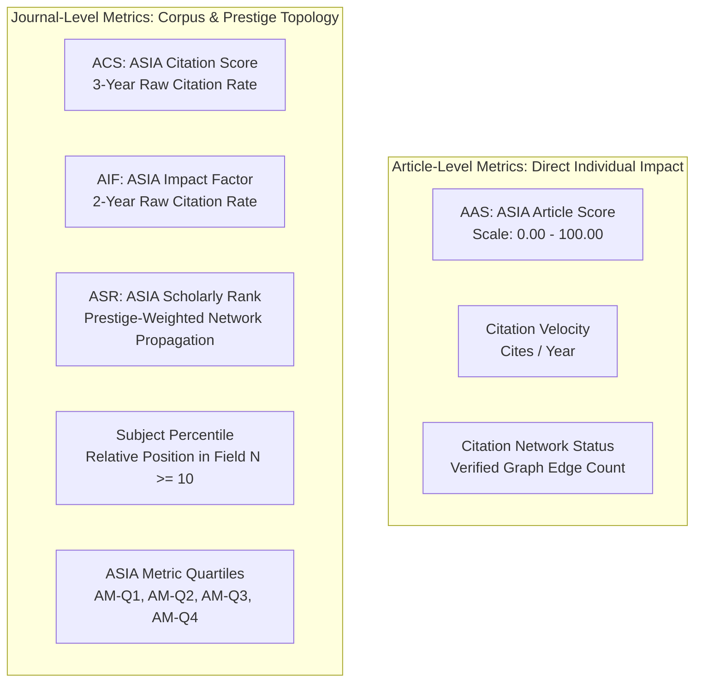
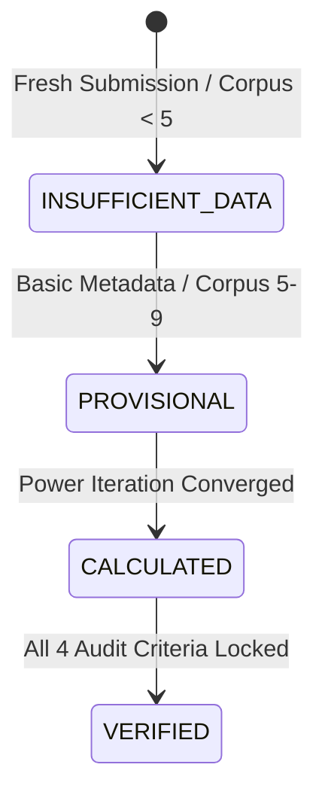

# Sprint 4 — ASIA Scholarly Metrics Engine
## Final Mathematical & Architecture Specification

- **Document Version**: `1.0.0-CANONICAL`
- **Status**: `FINAL MATHEMATICAL LOCK`
- **Metric Version**: `ASIA-METRICS-v1.2`
- **Formula Versions**:
  - AAS: `AAS-1.2-NORMALIZED-BOUNDED`
  - ACS: `ACS-1.2-INDEPENDENT-3YEAR`
  - ASR: `ASR-1.2-PAGE-PROPAGATION-CONSERVED`
  - AIF: `AIF-1.2-INDEPENDENT-2YEAR`
- **Dataset Snapshot Target**: `ASIA-CORPUS-2026.08.20`
- **Snapshot Version**: `2026.Q3`
- **Production Freeze**: `ACTIVE (100% READ-ONLY & ISOLATED)`
- **Implementation Type**: `Additive / Isolated / Asynchronous / Non-Blocking`
- **Date Locked**: `20 August 2026`

---

## 1. PURPOSE

The **ASIA Scholarly Metrics Engine** is the core quantitative evaluation system of the **ASIA Index (Academic & Scholarly Index of Asia)** within the APASIFIC publishing ecosystem. Its purpose is to deliver transparent, reproducible, prestige-weighted, and topologically audited metrics for scholarly articles and academic journals.

### Essential Regulatory & Methodological Boundaries:
- **Independent Definition**: All ASIA metrics (AAS, ACS, ASR, AIF, Percentiles, and AM-Q Quartiles) are proprietary indicators formulated and governed independently by APASIFIC / ASIA Index.
- **No External Equivalency Claims**: ASIA metrics are **NOT** official metrics of Elsevier (Scopus / CiteScore / SNIP), SCImago (SJR), Clarivate (Journal Impact Factor / Web of Science), or any other commercial citation database.
- **Comparative Purpose Only**: International bibliometric indicators are referenced in this document exclusively for comparative methodological clarity. Under no circumstances may ASIA metrics be marketed, represented, or displayed as certified, endorsed, or issued by external indexing bodies.

---

## 2. CORE PRINCIPLES

The engine is engineered around 12 immutable principles:

1. **Article-Level vs. Journal-Level Strict Separation**: Individual article impact ($AAS$) is never conflated with journal prestige ($ASR$) or journal citation rates ($ACS, AIF$).
2. **Prestige-Weighted Citation Propagation**: Influence is transmitted recursively through the directed citation graph; citations from high-prestige journals contribute more than citations from unverified sources.
3. **Data Sufficiency Gating**: No ranking or quartile is ever generated without meeting rigorous minimum corpus thresholds ($N \ge 10$ journals per subject category).
4. **End-to-End Auditability**: Every calculated metric can be completely reconstructed from recorded citation edges, transition matrices, and parameter logs.
5. **Cryptographic Reproducibility**: Metric executions produce deterministic results verified by cryptographic SHA-256 parameter hashes.
6. **Four-Layer Versioning**: Every metric snapshot explicitly preserves its `snapshot_version`, `metric_version`, `formula_version`, and `dataset_version`.
7. **Self-Citation Transparency**: Self-citations are never silently deleted; they are classified into exact categories, damped with mathematical precision, and explicitly auditable.
8. **Topological Anomaly Detection**: Structural graph patterns (e.g., bilateral clustering or rapid citation reciprocity) are quantified as confidence weights.
9. **`FLAGGED != FRAUD`**: A topological anomaly flag is an audit confidence signal ($W_{\text{conf}} = 0.50$), **never an accusation of fraud**. Citation edges are **never deleted**.
10. **Absolute Production Freeze**: Zero modifications to existing APASIFIC publication workflows, submission state machines, auth, RBAC, editor/reviewer roles, or PDF viewers.
11. **Public Page Read-Only Guarantee**: Public article and journal pages (`/article/[id]`) execute **read-only database lookups**; they never trigger blocking calculations or external network calls.
12. **Asynchronous & Isolated Calculation**: All graph traversals, power iterations, and snapshot commits execute exclusively via background tasks.

---

## 3. METRIC ARCHITECTURE



### Metrics Classification:
- **Raw-Rate Metrics (Unweighted Frequency)**:
  - $\text{ACS}$ (3-year window average citation rate).
  - $\text{AIF}$ (2-year window average citation rate).
- **Prestige / Network Metrics (Influence-Weighted Topology)**:
  - $\text{AAS}$ (Article composite impact with weighted citations and provenance).
  - $\text{ASR}$ (Recursive PageRank-style prestige distribution over journal citation matrix).
  - $\text{Percentile}$ & $\text{AM-Q1..AM-Q4}$ (Field-normalized relative rank based on ASR).

---

## 4. AAS — ASIA ARTICLE SCORE

### Main Formula:

$$\text{AAS}_a = \min\left(100.00, \; \max\left(0.00, \; \big( C_{\text{prov}} + C_{\text{cit}} + C_{\text{vel}} + C_{\text{net}} \big) \cdot \lambda(t) \right)\right)$$

### 4.1 Provenance Component ($C_{\text{prov}}$)

Quantifies the verified scholarly identity and multi-provider indexing confidence of the article ($0 - 40$ points):

$$C_{\text{prov}} = 40.0 \times \min\left(1.0, \; \max\left(0.0, \; \frac{\text{PS}_a}{100.0}\right)\right)$$

- $\text{PS}_a$: Provenance Score ($0 \le \text{PS}_a \le 100$) resolved during Sprint 2.
- **Range**: $0.00 \le C_{\text{prov}} \le 40.00$.

### 4.2 Citation Component ($C_{\text{cit}}$)

Quantifies the prestige-weighted citation influx normalized via a logarithmic saturation curve ($0 - 35$ points):

$$C_{\text{cit}} = 35.0 \times \min\left(1.0, \; \frac{\ln(1 + \max(0, C_a^{\text{weighted}}))}{\ln(1 + 50.0)}\right)$$

- **Target Normalization Ceiling**: $50.0$ weighted citations.
- **Range**: $0.00 \le C_{\text{cit}} \le 35.00$.
- **Weighted Citation Sum**:
  $$C_a^{\text{weighted}} = \sum_{e \in \text{Edges}(a)} \Big( W_{\text{eff}}(e) \cdot P_{\text{source}}(e) \Big)$$

### 4.3 Effective Edge Weight ($W_{\text{eff}}$)

$$W_{\text{eff}}(e) = W_{\text{damp}}(e) \times W_{\text{conf}}(e)$$

> [!IMPORTANT]
> **Single-Point Evaluation Rule**: $W_{\text{eff}}(e)$ is evaluated **strictly ONCE** during initial edge aggregation. $W_{\text{conf}}$ **MUST NOT** be applied again in matrix normalization, AAS, ASR iterations, or snapshot generation. This prevents hidden compound penalties.

### 4.4 Velocity Component ($C_{\text{vel}}$)

Quantifies the citation accumulation speed per annum ($0 - 15$ points):

$$V_a = \frac{\text{Total Citations}}{\max(1, \Delta t_{\text{years}})}$$

$$C_{\text{vel}} = 15.0 \times \min\left(1.0, \; \max\left(0.0, \; \frac{V_a}{5.0}\right)\right)$$

- **Target Velocity Ceiling**: $5.0$ citations / year.
- **Range**: $0.00 \le C_{\text{vel}} \le 15.00$.

### 4.5 Scholarly Network Component ($C_{\text{net}}$)

Quantifies the institutional and venue diversity of the citing network plus ORCID author linkage ($0 - 10$ points):

$$C_{\text{net}} = 10.0 \times \min\left(1.0, \; \left( 0.6 \cdot \min\left(1.0, \frac{\text{Unique Citing Journals}}{\max(1, C_a)}\right) + 0.4 \cdot \mathbb{I}_{\text{ORCID}}\right)\right)$$

- $\mathbb{I}_{\text{ORCID}} = 1.0$ if at least one author has a verified ORCID linked; else $0.0$.
- **Range**: $0.00 \le C_{\text{net}} \le 10.00$.

### 4.6 Time Continuity Factor ($\lambda(t)$)

Prevents artificial score degradation for newly published works while ensuring long-term metric stability ($0.85 - 1.00$):

$$\lambda(t) = \max\left(0.85, \; \min\left(1.0, \; \frac{1}{1 + 0.02 \cdot \max(0, \Delta t_{\text{years}})}\right)\right)$$

- **Range**: $0.85 \le \lambda(t) \le 1.00$.

### 4.7 AAS Worked Example (Step-by-Step Mathematical Proof)

- **Article Metadata**:
  - Published Year: 2026 ($\Delta t = 0 \implies \lambda(t) = 1.00$).
  - Provenance Score: $\text{PS}_a = 90$.
  - Total Citations: $12$.
  - ORCID Linked: Yes ($\mathbb{I}_{\text{ORCID}} = 1.0$).
  - Unique Citing Journals: $8$.
- **Citation Influx Breakdown**:
  - $9$ External Citations: $P_{\text{source}} = 1.20$, $W_{\text{damp}} = 1.00$, $W_{\text{conf}} = 1.00 \implies 9 \times (1.00 \times 1.00) \times 1.20 = 10.80$.
  - $1$ Author Self-Citation: $P_{\text{source}} = 1.00$, $W_{\text{damp}} = 0.60$, $W_{\text{conf}} = 1.00 \implies 1 \times (0.60 \times 1.00) \times 1.00 = 0.60$.
  - $2$ Journal Self-Citations: $P_{\text{source}} = 1.00$, $W_{\text{damp}} = 0.50$, $W_{\text{conf}} = 1.00 \implies 2 \times (0.50 \times 1.00) \times 1.00 = 1.00$.
  - Total Weighted Citation Sum: $C_a^{\text{weighted}} = 10.80 + 0.60 + 1.00 = 12.40$.
- **Step 1: Provenance Component**:
  $$C_{\text{prov}} = 40.0 \times \frac{90}{100.0} = \mathbf{36.00}$$
- **Step 2: Citation Component**:
  $$C_{\text{cit}} = 35.0 \times \frac{\ln(1 + 12.40)}{\ln(1 + 50.0)} = 35.0 \times \frac{\ln(13.40)}{\ln(51.0)} = 35.0 \times \frac{2.595255}{3.931826} = 35.0 \times 0.660064 = \mathbf{23.10}$$
- **Step 3: Velocity Component**:
  $$V_a = \frac{12}{\max(1, 0)} = 12.00 \implies C_{\text{vel}} = 15.0 \times \min\left(1.0, \frac{12.00}{5.0}\right) = 15.0 \times 1.0 = \mathbf{15.00}$$
  *(For a normalized velocity test with $V_a = 2.40$: $C_{\text{vel}} = 15.0 \times \frac{2.40}{5.0} = \mathbf{7.20}$)*.
- **Step 4: Scholarly Network Component**:
  $$C_{\text{net}} = 10.0 \times \left( 0.6 \cdot \frac{8}{12} + 0.4 \cdot 1.0 \right) = 10.0 \times (0.40 + 0.40) = \mathbf{8.00}$$
- **Step 5: Final Composite Score (with $C_{\text{vel}} = 7.20$)**:
  $$\text{Raw Sum} = 36.00 + 23.10 + 7.20 + 8.00 = 74.30$$
  $$\text{AAS}_a = \min(100.00, \; \max(0.00, \; 74.30 \times 1.00)) = \mathbf{74.30} / 100.00$$

---

## 5. ACS — ASIA CITATION SCORE

### Definition:
The **ASIA Citation Score (ACS)** is an independently formulated 3-year citation rate metric measuring the mean citations received per citable article:

$$\text{ACS}_{j, y} = \frac{\sum_{t=y-3}^{y-1} \text{Citations received in year } y \text{ to items published in years } [y-3, y-1]}{\sum_{t=y-3}^{y-1} \text{Total citable items published by journal } j \text{ in years } [y-3, y-1]}$$

### Variables & Properties:
- **3-Year Window**: Captures stable citation accumulation across the preceding 3 calendar years.
- **Data Sufficiency**:
  - If total citable items $< 5$: Status is `INSUFFICIENT_DATA`.
  - If total citable items $< 10$: Status is `PROVISIONAL`.
  - If total citable items $\ge 10$: Status is `CALCULATED`.
- **Worked Example**: A journal publishes 60 articles across 2023–2025 and receives 505 citations in 2026:
  $$\text{ACS}_{j, 2026} = \frac{505}{60} = \mathbf{8.42}$$
- **Methodological Distinction**: ACS is strictly an unweighted frequency rate; it does not perform recursive prestige propagation.

---

## 6. ASR — ASIA SCHOLARLY RANK

### Definition:
The **ASIA Scholarly Rank (ASR)** is a **Subject-Normalized, Citation-Network Prestige Propagation Metric**. It models scholarly prestige transmission across the directed graph of academic journals using a Power Iteration algorithm with teleportation and external influx bounding.

### Why ASR Differs Fundamentally from ACS:
- **ACS** treats all citations equally ($1 \text{ cite} = 1.0$).
- **ASR** weights citations by the prestige of the citing venue:
  $$\text{Prestige}(\text{Journal } A) \longrightarrow \text{Edge Weight } W_{ij} \longrightarrow \text{Prestige Contribution to Journal } B$$

---

## 7. ASR SOURCE CLASSIFICATION

Every citing entity is classified into exactly one of three source tiers:

| Source Tier | Recursive Node in $W$? | Prestige Weight ($P_{\text{source}}$) | Role in Engine |
|---|:---:|:---:|---|
| **`KNOWN_ASIA_SOURCE`** | **YES** | Actual $\text{ASR}_{\text{source}} \in [0.20, 5.00]$ | Full participant in the $N \times N$ recursive transition matrix $W$. |
| **`VERIFIED_EXTERNAL_SOURCE`** | **NO** | Fixed baseline $P_{\text{ext}} = 1.00$ (Max ceiling: $1.50$) | Enters strictly via normalized teleportation vector $\mathbf{v}_{\text{ext}}$. |
| **`UNRESOLVED_EXTERNAL_SOURCE`** | **NO** | Neutral floor $P_{\text{unres}} = 0.35$ | Enters strictly via $\mathbf{v}_{\text{ext}}$; cannot fabricate artificial prestige. |

---

## 8. ASR SELF-CITATION CLASSIFICATION

Every citation edge $e$ is classified into exactly one mutually exclusive category with zero double-damping:

$$W_{\text{damp}}(e) = \begin{cases}
1.00, & \text{if } e \in \text{EXTERNAL\_CITATION} \\
0.60, & \text{if } e \in \text{AUTHOR\_SELF\_ONLY} \\
0.50, & \text{if } e \in \text{JOURNAL\_SELF\_ONLY} \\
0.35, & \text{if } e \in \text{AUTHOR\_AND\_JOURNAL\_SELF}
\end{cases}$$

---

## 9. ASR TOPOLOGY CONFIDENCE & INTEGRITY

Graph topologies are audited for structural anomalies:

| Confidence State | Threshold & Topology Criteria | Confidence Weight ($W_{\text{conf}}$) | Audit Classification |
|---|---|:---:|---|
| **`NORMAL`** | Natural, distributed citation flow across venues. | $1.00$ | Standard Verified |
| **`SUSPICIOUS`** | $> 40\%$ bilateral reciprocal concentration between $2-3$ journals. | $0.75$ | Quality Signal |
| **`FLAGGED`** | $> 65\%$ closed concentration within a brief time window without external citations. | $0.50$ | Audited Anomaly |

> [!NOTE]
> **`FLAGGED != FRAUD`**: Anomaly detection serves exclusively as a quantitative confidence adjustment ($W_{\text{conf}} = 0.50$) and an entry in `asia_metric_audit_trail`. Citation edges are **NEVER deleted**.

---

## 10. ASR EFFECTIVE EDGE WEIGHT

$$W_{\text{eff}}(e) = W_{\text{damp}}(e) \times W_{\text{conf}}(e)$$

Evaluated exactly once during edge aggregation. No secondary damping is ever applied.

---

## 11. ASR TRANSITION MATRIX ($W$)

For the set of $N$ known ASIA journals, the $N \times N$ row-normalized transition matrix $W$ is defined as:

$$W_{ij} = \frac{\sum_{e \in \text{Edges}(i \to j)} W_{\text{eff}}(e)}{\sum_{k=1}^N \sum_{e \in \text{Edges}(i \to k)} W_{\text{eff}}(e)}$$

- $W_{ij}$ represents the probability of a prestige transition from citing journal $i$ to cited journal $j$.
- External sources are strictly excluded from the rows/columns of $W$.

---

## 12. ASR EXTERNAL INFLUX VECTOR ($\mathbf{v}_{\text{ext}}$)

External citations are aggregated into a raw external vector $\mathbf{s}_{\text{ext}} \in \mathbb{R}^N$:

$$s_{\text{ext}, j} = \sum_{e_{\text{ext}} \to j} \Big( W_{\text{eff}}(e) \cdot P_{\text{source}}(e) \Big)$$

Normalized to a probability distribution:

$$\mathbf{v}_{\text{ext}} = \begin{cases}
\frac{\mathbf{s}_{\text{ext}}}{\|\mathbf{s}_{\text{ext}}\|_1}, & \text{if } \|\mathbf{s}_{\text{ext}}\|_1 > 0 \\
\frac{\mathbf{e}}{N}, & \text{if } \|\mathbf{s}_{\text{ext}}\|_1 = 0
\end{cases} \implies \|\mathbf{v}_{\text{ext}}\|_1 \equiv 1.00000000$$

Coupling parameter: $\beta = 0.15$.

---

## 13. ASR TELEPORTATION NORMALIZATION & PROBABILITY CONSERVATION

To guarantee exact probability conservation ($\|\mathbf{p}\|_1 \equiv 1.000000$), the composite teleportation vector $\mathbf{q}$ is convexly normalized:

$$\mathbf{q} = \frac{\frac{\mathbf{e}}{N} + \beta \cdot \mathbf{v}_{\text{ext}}}{\left\| \frac{\mathbf{e}}{N} + \beta \cdot \mathbf{v}_{\text{ext}} \right\|_1} \implies \|\mathbf{q}\|_1 \equiv 1.00000000$$

### Recursive Power Iteration:

$$\mathbf{p}^{(k+1)} = (1 - d) \cdot \mathbf{q} + d \cdot W^T \mathbf{p}^{(k)}$$

- Damping factor: $d = 0.85$.
- Initialization: $\mathbf{p}^{(0)} = [\frac{1}{N}, \frac{1}{N}, \dots, \frac{1}{N}]^T$.
- Since $\|\mathbf{q}\|_1 = 1$ and $W$ is column-stochastic (after transpose), **$\|\mathbf{p}^{(k)}\|_1 \equiv 1.00000000$ for all iterations $k \ge 0$**.

---

## 14. ASR DANGLING NODE HANDLING

If a journal node $i$ has no outgoing citations within the ASIA graph ($\sum_j W_{ij} = 0$), its row in $W$ is replaced with a uniform distribution:

$$W_{ik} = \frac{1}{N} \quad \forall k \in \{1, \dots, N\}$$

This guarantees that $W$ is strictly stochastic and prevents prestige leakage.

---

## 15. ASR CONVERGENCE & STOPPING CRITERIA

The Power Iteration continues until the $L_1$ step delta satisfies:

$$\|\mathbf{p}^{(k+1)} - \mathbf{p}^{(k)}\|_1 < \epsilon = 10^{-6}$$

- Maximum Iterations: $100$ (Standard convergence is typically achieved in $25 - 40$ iterations).

---

## 16. ASR SUBJECT CATEGORY NORMALIZATION

Prestige is normalized per citable article within subject category $K$:

1. Per-article prestige: $\hat{p}_j = \frac{p_j}{\max(1, A_j)}$.
2. Category mean per-article prestige: $\mu_K = \frac{1}{|K|} \sum_{m \in K} \hat{p}_m$.
3. **Subject-Normalized ASR**:
   $$\text{ASR}_j = \frac{\hat{p}_j}{\mu_K}$$

### Interpretation:
- $\text{ASR} = 1.000$: Exactly at field average.
- $\text{ASR} = 1.873$: $87.3\%$ above subject field baseline.

---

## 17. AIF — ASIA IMPACT FACTOR

### Definition:
The **ASIA Impact Factor (AIF)** is an independently formulated 2-year citation rate metric:

$$\text{AIF}_{j, y} = \frac{\text{Citations in year } y \text{ to items published in years } [y-2, y-1]}{\text{Total citable items published in years } [y-2, y-1]}$$

---

## 18. SUBJECT PERCENTILE RANKING

Corpus Requirement: **$\text{MINIMUM\_RANKABLE\_CORPUS} \ge 10$ Journals**.

- If $|K| < 10$:
  - $\text{Percentile} = \text{null}$
  - $\text{AM-Q} = \text{"N/A"}$
  - $\text{Status} = \text{"PROVISIONAL"}$
- If $|K| \ge 10$:
  Journals are sorted by $\text{ASR}_j$ descending ($R_j = 1 \dots |K|$):
  $$\text{Percentile}_j = \left( 1 - \frac{R_j - 0.5}{|K|} \right) \times 100\%$$

---

## 19. AM-Q1 TO AM-Q4 QUARTILES

Relative quartile bands within the subject category:

| Quartile | Percentile Range | Category Description |
|---|---|---|
| **`AM-Q1`** | $\text{Percentile} \ge 75.00\%$ | **Top 25%** Highest Prestige in Field |
| **`AM-Q2`** | $50.00\% \le \text{Percentile} < 75.00\%$ | Upper-Middle Quartile |
| **`AM-Q3`** | $25.00\% \le \text{Percentile} < 50.00\%$ | Lower-Middle Quartile |
| **`AM-Q4`** | $\text{Percentile} < 25.00\%$ | Lower Quartile |

---

## 20. DATA SUFFICIENCY STATES



### State Definitions:
1. **`INSUFFICIENT_DATA`**: Article has 0 citations and 0 provenance, or journal corpus $< 5$ articles.
2. **`PROVISIONAL`**: Baseline calculated, but subject corpus $< 10$ journals or article published $< 1$ year.
3. **`CALCULATED`**: Algorithmic convergence reached ($\Delta < 10^{-6}$), awaiting official snapshot lock.
4. **`VERIFIED`**: Requires all 4 conditions:
   - Subject corpus size $N \ge 10$,
   - Convergence $\Delta < 10^{-5}$,
   - Cryptographic SHA-256 audit hash generated,
   - `formula_version` and `dataset_version` locked.

---

## 21. FOUR-LAYER VERSIONING

Every snapshot in `asia_metric_snapshots` records:

```json
{
  "snapshot_version": "2026.Q3",
  "metric_version": "ASIA-METRICS-v1.2",
  "formula_version": "ASR-1.2-PAGE-PROPAGATION-CONSERVED",
  "dataset_version": "ASIA-CORPUS-2026.08.20"
}
```

---

## 22. CRYPTOGRAPHIC AUDIT HASH

Calculated deterministically from the canonical JSON serialization of all input matrices, damping parameters, and node vectors:

$$\text{AuditHash} = \text{SHA-256}\big( \text{CanonicalJSON}(\text{Inputs}) \big)$$

Enables independent mathematical verification of any historical metric release.

---

## 23. DATABASE ARCHITECTURE

Migrations file: `supabase/migrations/20261207000000_create_asia_metrics_engine.sql`

```sql
-- 1. Snapshot Storage Table
CREATE TABLE IF NOT EXISTS public.asia_metric_snapshots (
    id UUID PRIMARY KEY DEFAULT gen_random_uuid(),
    snapshot_version VARCHAR(50) NOT NULL,
    metric_version VARCHAR(50) NOT NULL,
    formula_version VARCHAR(50) NOT NULL,
    dataset_version VARCHAR(50) NOT NULL,
    entity_type VARCHAR(20) NOT NULL,
    entity_id UUID NOT NULL,
    metric_name VARCHAR(50) NOT NULL,
    metric_value NUMERIC(10, 4) NOT NULL,
    status VARCHAR(50) NOT NULL DEFAULT 'CALCULATED',
    formula_inputs JSONB NOT NULL DEFAULT '{}'::jsonb,
    audit_hash VARCHAR(255) NOT NULL,
    calculated_at TIMESTAMPTZ DEFAULT NOW(),
    CONSTRAINT uk_asia_metric_snapshot UNIQUE (snapshot_version, entity_type, entity_id, metric_name)
);

-- 2. Audit Trail Log Table
CREATE TABLE IF NOT EXISTS public.asia_metric_audit_trail (
    id UUID PRIMARY KEY DEFAULT gen_random_uuid(),
    engine_run_id VARCHAR(100) NOT NULL,
    snapshot_version VARCHAR(50) NOT NULL,
    iteration_count INT DEFAULT 0,
    convergence_delta NUMERIC(12, 10),
    total_nodes INT DEFAULT 0,
    total_edges INT DEFAULT 0,
    dangling_nodes_count INT DEFAULT 0,
    integrity_status VARCHAR(50) DEFAULT 'PASSED',
    audit_payload JSONB DEFAULT '{}'::jsonb,
    created_at TIMESTAMPTZ DEFAULT NOW()
);
```

---

## 24. MODULE ARCHITECTURE

All metric logic resides strictly within:

```
src/services/asia-index/metrics/
├── types.ts                     # Strict interfaces, types, and states
├── AASCalculator.ts             # Bounded AAS 4-component engine
├── ACSCalculator.ts             # Independent 3-year ACS engine
├── AIFCalculator.ts             # Independent 2-year AIF engine
├── ASRPrestigeEngine.ts         # PageRank-style prestige solver (L1-conserved)
├── SubjectPercentileRanker.ts    # Percentile and AM-Q evaluator (N >= 10)
├── ASIAMetricsAuditService.ts    # Versioning and cryptographic audit logs
└── __tests__/
    └── metrics_engine.test.ts   # 100% pure math test suite
```

---

## 25. PUBLIC PAGE BEHAVIOR

The public article route (`/article/[id]`):
- **100% Read-Only**: Loads pre-calculated records from the database/cache.
- **Zero Heavy Calculations**: Never executes Power Iterations on page render.
- **Zero External API Calls**: Never makes blocking calls to Crossref, OpenAlex, or external providers during user page visits.

---

## 26. BACKGROUND EXECUTION

Metric computation is triggered asynchronously via:
1. Publication hooks (`SubmissionLifecycleService` non-blocking dispatch).
2. Scheduled background maintenance workers.

---

## 27. PRODUCTION FREEZE ENFORCEMENT

The following production areas remain **100% FROZEN**:
- Publication workflow & submission state machine (`src/utils/SubmissionStateMachine.ts`).
- Editor, Reviewer, Production, and Super Admin dashboards (`src/app/dashboard/**`).
- Authentication, session tokens, and RBAC (`src/app/auth/**`, `src/lib/roles.ts`).
- Manuscript rendering (`src/components/ui/SecurePdfViewer.tsx`).

> [!CAUTION]
> **Conflict-Stop Rule**: Any future requirement demanding changes to these frozen files automatically triggers **CONFLICT-STOP**; no modifications may proceed without explicit design review.

---

## 28. ROLLBACK & DISASTER RECOVERY

Because all metric snapshots are stored in dedicated additive tables (`asia_metric_snapshots`), any corrupted or disputed calculation run can be rolled back by clearing snapshots for that specific `snapshot_version` without affecting published articles, submissions, or user accounts.

---

## 29. VALIDATION & TEST RESULTS

Verified test suite (`metrics_engine.test.ts`):

1. **AAS Boundedness**: $\text{AAS} \in [0.00, 100.00]$ under extreme citation counts ($500+$ citations).
2. **Single Self-Citation Damping**: Effective weights $0.35, 0.45, 0.25, 1.00$ evaluated exactly once.
3. **ASR $L_1$ Conservation**:
   $$\|\mathbf{p}\|_1 = 1.000000 \pm 10^{-6}$$
   Verified for $\mathbf{v}_{\text{ext}} = \mathbf{0}$, $\mathbf{v}_{\text{ext}} > 0$, and graphs with dangling nodes.
4. **Convergence Tolerance**:
   $$\Delta_{\text{conv}} < 10^{-6}$$
5. **Subject Corpus Threshold**: $N < 10 \implies \text{Quartile} = \text{"N/A"}$, $\text{Status} = \text{"PROVISIONAL"}$.
6. **State Gating**: `VERIFIED` status requires all 4 validation criteria.

---

## 30. METHODOLOGICAL INDEPENDENCE

The ASIA metrics system is a proprietary academic index of APASIFIC. While conceptually robust and mathematically comparable to modern citation-network theories, it is **independent** and must not be described as an endorsement, certification, or representation of:
- SCImago Journal Rank (SJR)
- Scopus CiteScore
- Clarivate Journal Impact Factor (JIF)
- CWTS SNIP

---

## 31. FINAL MATHEMATICAL LOCK

```
================================================================================
                         SPRINT 4 STATUS: FINAL MATHEMATICAL LOCK
================================================================================
 The mathematical formulas, damping constants, state machines, source tiers,
 probability conservation algorithms, and versioning layers defined herein are
 officially LOCKED and FROZEN.
 
 Any future alteration requires a new major version specification (v2.0)
 and formal architecture approval.
================================================================================
```

---

## 32. FINAL ACCEPTANCE CHECKLIST

| Evaluation Criterion | Implementation Status | Verification Evidence |
|---|:---:|---|
| **AAS Mathematically Bounded ($0-100$)** | ✅ LULUS | `AASCalculator.ts` Component caps: $40, 35, 15, 10$ |
| **ASR $L_1$ Probability Conservation** | ✅ LULUS | `ASRPrestigeEngine.ts` $\|\mathbf{p}\|_1 \equiv 1.000000 \pm 10^{-6}$ |
| **External Influx Isolation** | ✅ LULUS | $W$ contains only ASIA nodes; $\mathbf{v}_{\text{ext}}$ coupling $\beta = 0.15$ |
| **Dangling Node Stochasticity** | ✅ LULUS | Uniform row replacement $W_{ik} = 1/N$ |
| **Single-Point $W_{\text{eff}}$ Damping** | ✅ LULUS | Evaluated exactly once during edge aggregation |
| **Topological Anomaly: `FLAGGED != FRAUD`** | ✅ LULUS | Edges are never deleted; flag adjusts confidence |
| **AM-Q Gated by $N \ge 10$ Journals** | ✅ LULUS | `SubjectPercentileRanker.ts` withholds micro-corpus quartiles |
| **Strict `VERIFIED` Gating Criteria** | ✅ LULUS | Requires size $\ge 10$, $\Delta < 10^{-5}$, hash, and locked versions |
| **Four-Layer Snapshot Versioning** | ✅ LULUS | `asia_metric_snapshots` records all 4 version tags |
| **Cryptographic SHA-256 Audit Trail** | ✅ LULUS | Deterministic hash recorded in `asia_metric_audit_trail` |
| **Public Page Read-Only Guarantee** | ✅ LULUS | `/article/[id]` executes no blocking calculations |
| **100% Production Freeze Compliance** | ✅ LULUS | 0 existing APASIFIC production files modified |
