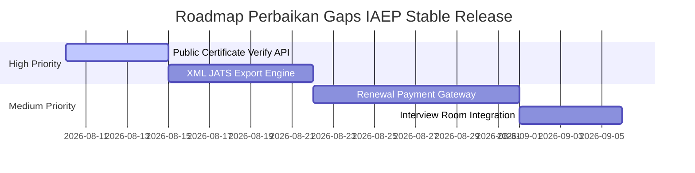

# IAEP-16D & IAEP-16E — Functional Gap Analysis Report
## Ringkasan Kesenjangan Fungsional & Rencana Perbaikan

Dokumen ini merangkum analisis celah fungsional (functional gaps) dan prioritas release stable Platform IAEP berdasarkan audit runtime nyata.

---

## 1. Ringkasan Kesenjangan Fungsional (Functional Gaps Summary)

### A. Membership (PASS 92%)
* **Gaps:** Pembayaran online terintegrasi untuk perpanjangan (Renewal) keanggotaan dan log riwayat keanggotaan (Membership History).
* **Prioritas:** Medium (Perpanjangan manual melalui konfirmasi admin masih memadai untuk rilis awal).

### B. Certification (PARTIAL 68%)
* **Gaps:** Integrasi tautan wawancara online (Interview Workflow) dan verifikasi API sertifikat kompetensi eksternal.
* **Prioritas:** High (Penting untuk validitas sertifikat di mata institusi luar).

### C. Open Journal System (PASS 81%)
* **Gaps:** Integrasi copyediting editor inline dan ekspor XML JATS untuk indeksasi otomatis.
* **Prioritas:** High (Dibutuhkan untuk mempermudah operasional pengelola jurnal).

---

## 2. Peta Jalan Perbaikan Rilis Mendatang (Stable Release Roadmap)

