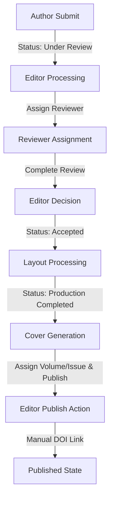

# ASIA Publication Zenodo Flow Audit Report

Laporan audit ini memetakan alur kerja publikasi eksistensial, pelacakan DOI, integrasi dengan Zenodo, serta penyimpanan data di database untuk memverifikasi kesiapan alur publikasi **ASIA**.

---

## 1. Current Flow Diagram

---

## 2. Existing Implementation Status

### Editor Publish Action
* **Lokasi Berkas:** [editor.ts (src/app/actions/editor.ts)](file:///d:/Users/apasific/iaep-app/src/app/actions/editor.ts#L783-L870)
* **Fungsi Utama:** `publishArticle`
* **Urutan Eksekusi:**
  1. Menghitung Volume dan Issue secara dinamis via `getNextVolumeAndIssue`.
  2. Memperbarui status submisi menjadi `'Published'` dan stage menjadi `'Published'` di tabel `submissions`.
  3. Mencatat riwayat ke `submission_history`.
  4. Membuat/memperbarui sertifikat penerbitan di tabel `certificates`.

---

## 3. DOI & Zenodo Integration Handling

### Status Konektivitas
* **Metode Deposit:** Saat ini, sistem berjalan dengan pola **B (Publish dulu, deposit manual)**. 
* **Penyebab:** Fungsi `publishArticle` tidak memiliki pemanggilan otomatis ke `PublicationDepositService` atau `depositToZenodo`. Editor harus memperbarui DOI secara manual melalui fungsi `updateDoi` atau pemicu eksternal.
* **Integrasi Zenodo:** Komponen penyedia [ZenodoProvider.ts](file:///d:/Users/apasific/iaep-app/src/providers/zenodo/ZenodoProvider.ts) dan orkestrator [PublicationDepositService.ts](file:///d:/Users/apasific/iaep-app/src/services/publication-federation/PublicationDepositService.ts) sudah siap untuk melakukan deposit, pengunggahan berkas, dan mempublikasikan record secara otomatis, tetapi belum dipanggil di dalam file `editor.ts`.

---

## 4. Database Persistence

* **Tabel Submissions:** 
  * `doi` (VARCHAR) -> Menyimpan nilai DOI (misal: `10.5281/zenodo.21633609`).
  * `zenodo_id` (VARCHAR) -> Menyimpan ID deposisi Zenodo (misal: `21633609`).
  * `index_status` (JSONB) -> Menyimpan status indeks keseluruhan (termasuk Zenodo, OpenAIRE, dan Google Scholar).
* **Tabel Pendukung (Federation):**
  * `external_publication_records` -> Menyimpan pemetaan data bukti ringan dari provider eksternal.
  * `external_evidence_payloads` -> Menyimpan payload mentah yang dienkripsi atau di-hash dari Zenodo.

---

## 5. Trace of Existing Published Articles
Berdasarkan berkas diagnostik [check_specific_dois.js](file:///d:/Users/apasific/iaep-app/check_specific_dois.js), artikel publikasi ASIA yang terbit dihubungkan ke record Zenodo berikut:
* **DOI:** `10.5281/zenodo.21633609` (Zenodo ID: `21633609`)
* **DOI:** `10.5281/zenodo.21580255` (Zenodo ID: `21580255`)
* **DOI:** `10.5281/zenodo.21535734` (Zenodo ID: `21535734`)
* **DOI:** `10.5281/zenodo.21535711` (Zenodo ID: `21535711`)
* **DOI:** `10.5281/zenodo.21535685` (Zenodo ID: `21535685`)
* **DOI:** `10.5281/zenodo.21535656` (Zenodo ID: `21535656`)

Semua artikel ini terdaftar di database Supabase dan memetakan status visibility secara dinamis.

---

## 6. Risk Assessment & Recommendations

### Risiko
* **Ketidaksesuaian DOI (Desync):** Jika editor menginputkan DOI secara manual, terdapat risiko desinkronisasi data antara metadata lokal ASIA dengan record yang sebenarnya terdaftar di Zenodo.
* **Proses Manual Berlebih:** Editor harus mengunggah manuskrip dan mengisi form di Zenodo secara terpisah, yang bertentangan dengan tujuan otomatisasi ASIA.

### Rekomendasi
* **Pemicuan Otomatis (A):** Pada fase pengembangan selanjutnya, integrasikan `PublicationDepositService.depositToZenodo` langsung di dalam fungsi `publishArticle` pada berkas `editor.ts`.
* **Mekanisme Fallback:** Sediakan tombol "Sync Zenodo/DOI" cadangan pada dasbor Editor untuk menangani kegagalan jaringan sementara tanpa membatalkan proses penerbitan naskah utama.
